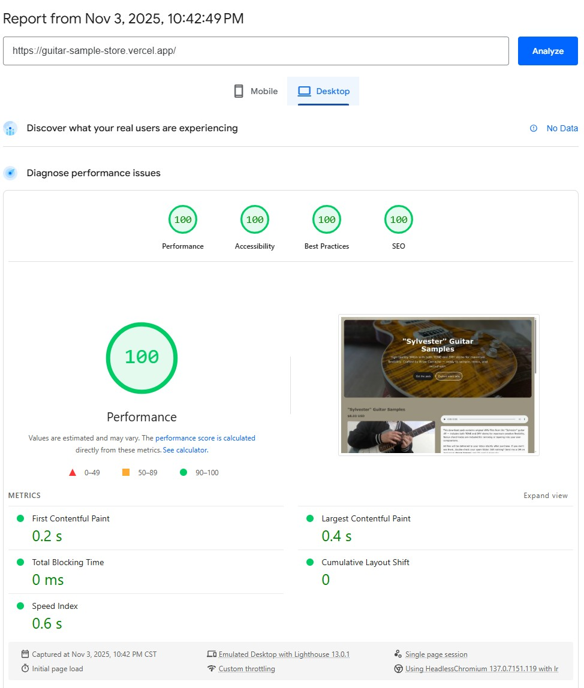
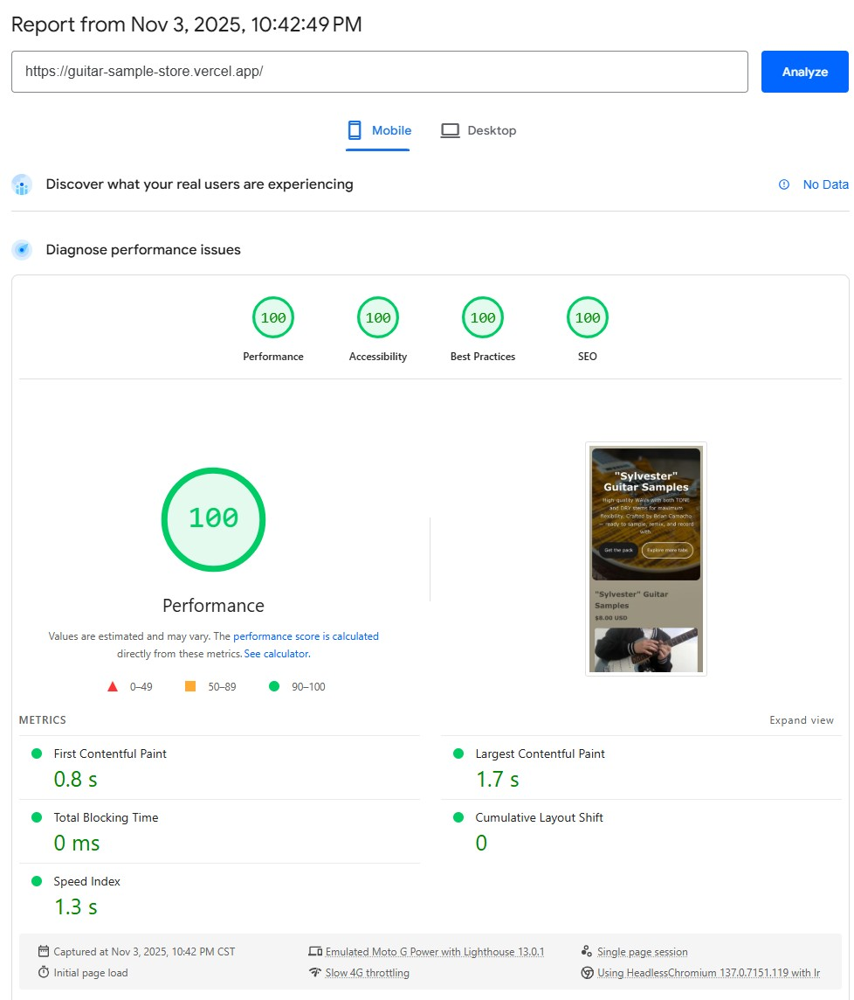

# Guitar Sample Store - Landing Page

[](https://guitar-sample-store.vercel.app/)
[](https://vercel.com)

A modern, responsive landing page for selling guitar sample packs. Developed by **Robert Cushman** as a portfolio project for student **Brian Camacho** (guitarist and web developer), showcasing clean design, SEO best practices, and modern web development techniques.

**🌐 Live Site**: [https://guitar-sample-store.vercel.app/](https://guitar-sample-store.vercel.app/)  
**Last Updated**: November 3, 2025

## 🏆 Performance Scores

Perfect scores across all metrics on both mobile and desktop!

### Desktop Performance


### Mobile Performance


**Achieved:**
- ✅ **100/100** Performance
- ✅ **100/100** Accessibility
- ✅ **100/100** Best Practices
- ✅ **100/100** SEO

## 📋 Project Overview

This is a single-page e-commerce landing page for "Sylvester" guitar samples by Brian Camacho (guitarist, producer, and sample maker). The page features:

- **Product showcase** with audio preview
- **PayPal integration** for payments
- **Responsive design** (mobile-first approach)
- **Modern UI/UX** with scroll animations and parallax effects
- **SEO optimized** with structured data and social meta tags
- **Dark mode support** (automatic based on system preference)

## ⚡ Features

### Design & UX

- Clean, modern aesthetic with beige/brown color palette
- Smooth scroll animations using Intersection Observer
- Subtle parallax effect on hero section
- Responsive grid layout for product cards
- Mobile-optimized navigation and layout

### Technical

- **Semantic HTML5** for accessibility and SEO
- **CSS Grid & Flexbox** for modern layouts
- **Vanilla JavaScript** (no framework dependencies)
- **Web Share API** integration with clipboard fallback
- **Structured data (JSON-LD)** for rich search results
- **Open Graph & Twitter Cards** for social sharing

### SEO

- Comprehensive meta tags (description, keywords, author)
- Open Graph tags for Facebook/LinkedIn
- Twitter Card tags for Twitter sharing
- Canonical URL to prevent duplicate content
- Product schema markup (JSON-LD)
- Sitemap and robots.txt

## 📂 Project Structure

```
my-guitar-tabs/
├── index.html          # Main landing page
├── styles.css          # All styles (responsive, dark mode)
├── script.js           # Animations, share functionality
├── robots.txt          # Search engine directives
├── sitemap.xml         # Site structure for crawlers
├── README.md           # This file
└── images/             # Product images and assets
```

## 💻 Technologies Used

- **HTML5** - Semantic markup
- **CSS3** - Grid, Flexbox, custom properties, media queries
- **JavaScript (ES6+)** - Intersection Observer, Web Share API
- **PayPal** - Payment processing

## 📐 Responsive Breakpoints

- **Desktop**: 900px and above (2-column layout)
- **Tablet**: 600px - 900px (stacked layout, 2-column grid)
- **Mobile**: Below 600px (single column, optimized touch targets)

## 🎯 Design Principles

Following core coding principles:

- **SRP** (Single Responsibility Principle)
- **DRY** (Don't Repeat Yourself)
- **SoC** (Separation of Concerns)
- **Mobile-first** responsive design
- **Accessibility** awareness (semantic HTML, ARIA labels)

## ⚙️ Setup & Deployment

### Local Development

1. Clone or download the repository
2. Open `index.html` in a modern browser
3. No build process required - pure HTML/CSS/JS

### Before Going Live

- [ ] Replace `https://yourcustomdomain.com` with actual domain
- [ ] Update social media links in footer
- [ ] Add real product images for "More Tabs" section
- [ ] Create Privacy Policy and Terms pages
- [ ] Set up analytics (Google Analytics, Plausible, etc.)
- [ ] Optimize images (WebP format, proper sizing)
- [ ] Test on multiple devices and browsers
- [ ] Validate HTML/CSS (W3C validators)
- [ ] Test social sharing previews

## ✨ Portfolio Highlights

This project demonstrates:

- ✅ Modern CSS techniques (Grid, Flexbox, custom properties)
- ✅ Vanilla JavaScript (no jQuery or heavy frameworks)
- ✅ SEO best practices and structured data
- ✅ Responsive design and mobile optimization
- ✅ Accessibility considerations
- ✅ Clean, maintainable code structure
- ✅ Performance optimization (lazy loading, efficient animations)

## 🔮 Future Enhancements

Potential improvements for a production version:

- Shopping cart functionality
- Multiple product pages
- Email delivery automation
- Customer reviews/testimonials
- Blog section for content marketing
- Newsletter signup
- Advanced analytics and conversion tracking

## 📜 License

This is a student portfolio project. Feel free to use as a reference or template.

## 👤 Credits

**Co-Developers**: Robert Cushman & Brian Camacho
_Web Developer & Portfolio Architect_

**Student/Client**: Brian Camacho  
_Guitarist • Producer • Sample Maker • Web Developer_

---

_Developed by Robert Cushman with attention to detail, modern web standards, and best practices._
